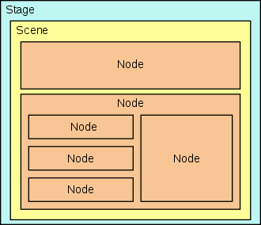

# JavaFX Notizen

## Aufbau

* Die Klasse erweitert die Klasse `javafx.appplication.Application`:

```java
public class ClassName extends Application {}
```

* `main`-Methode muss `launch()` ausführen:

```java
launch(args);
```

* Die Methode `start(Stage stage)` muss überschrieben werden:

```java
@Override
public void start(final Stage stage) {}
```

* Ein Parent (Pane) muss erstellt werden:

```java
final StackPane stackPane = new StackPane();
```

* _Oder:_ Kann auch per `.fxml`-Datei gemacht werden:

```java
Parent root = FXMLLoader.load(getClass().getResource("sample.fxml"));
```

* Szene muss gesetzt werden:

```java
stage.setScene(new Scene(Parent root, double with, double height));
```

* Stage muss gestartet werden:

```java
stage.show();
```

## Komponenten

### Hauptbestandteile



#### Stage

`javafx.stage.Stage`

* Subklasse von `Window`
* Ist der visuelle Rahmen der Applikation.

#### Scene

`javafx.scene.Scene`

* Containerkomponente
* Neue Scene erstellen mit `new Scene(Parent root, double with, double height)`

#### Node

`javafx.scene.Node`

* Elemente werden hierarchisch wie ein Baum strukturiert.

#### Parent

`javafx.scene.Parent`

* Subklasse von `Node`
* Basisklasse für alle Nodes, die in der Scene gebraucht werden

### Layouts

#### Stackpane

`javafx.scene.layout.StackPane`

* Subklasse von `Pane, Parent, Node`
* Ordnet Elemente untereinander an.

### Weitere Elemente

#### Labels

`javafx.scene.control.Label`

* Subklasse von `Control, Parent, Node`
* Stellt Text dar.

#### Title

```java
stage.setTitle("String");
```

* Setzt den Titel des Applikationsfensters

### Konfiguration

#### Stage

* Fenstergrösse änderbar

```java
stage.setResizable(true);
```

* Positionierung

```java
stage.centerOnScreen();
```

### Einsetzen

#### Nodes verknüpfen

Beispiel: Label an Pane anhängen:
```java
pane.getChildren().add(new Label("Label"))
```